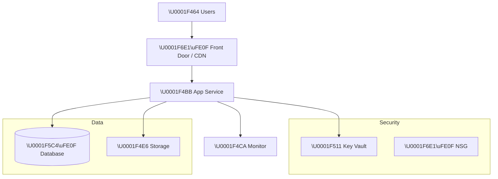

# 🏛️ Step 2: Architecture Assessment - {project-name}

<strong>📑 Assessment Contents</strong>

- [✅ Requirements Validation](#-requirements-validation)
- [💎 Executive Summary](#-executive-summary)
- [📦 Resource SKU Recommendations](#-resource-sku-recommendations)
- [🎯 Architecture Decision Summary](#-architecture-decision-summary)
- [🚀 Implementation Handoff](#-implementation-handoff)
- [🔒 Approval Gate](#-approval-gate)

> Generated by architect agent | {date}

| ⬅️ Previous                              | 📑 Index            | Next ➡️                                            |
| ---------------------------------------- | ------------------- | -------------------------------------------------- |
| [01-requirements.md](01-requirements.md) | [README](README.md) | [04-governance-constraints.md](04-governance-constraints.md) |

## ✅ Requirements Validation

| Requirement Area        | Status                               | Validation Notes |
| ----------------------- | ------------------------------------ | ---------------- |
| NFRs (SLA, RTO, RPO)    | ✅ Defined / ⚠️ Partial / ❌ Missing | {notes}          |
| Compliance requirements | ✅ Defined / ⚠️ Partial / ❌ Missing | {notes}          |
| Scale requirements      | ✅ Defined / ⚠️ Partial / ❌ Missing | {notes}          |
| Security controls       | ✅ Defined / ⚠️ Partial / ❌ Missing | {notes}          |
| Data residency          | ✅ Defined / ⚠️ Partial / ❌ Missing | {notes}          |

> [!WARNING]
> Any ❌ items above must be resolved before proceeding to implementation.

---

## 💎 Executive Summary

Brief narrative summary of the workload and recommended approach.

### Recommended Architecture

> Replace the above with actual architecture for the project.

---

## 📦 Resource SKU Recommendations

| Service   | Recommended SKU | Configuration | Justification |
| --------- | --------------- | ------------- | ------------- |
| {service} | {sku}           | {config}      | {why}         |

---

## 🎯 Architecture Decision Summary

| Decision   | Choice | Rationale |
| ---------- | ------ | --------- |
| Decision 1 |        |           |
| Decision 2 |        |           |

### Top Architecture Risks

| Risk   | Likelihood                  | Impact                      | Mitigation   |
| ------ | --------------------------- | --------------------------- | ------------ |
| {risk} | {🔴 High / 🟡 Med / 🟢 Low} | {🔴 High / 🟡 Med / 🟢 Low} | {mitigation} |

> Limit to the top 5 architecture-level risks.

---

## 🚀 Implementation Handoff

### Ready for iac-planner

The architecture is approved for implementation with the following key parameters:

| Parameter      | Value      |
| -------------- | ---------- |
| Region         | {region}   |
| Environment    | {env}      |
| Resource Count | {count}    |

### Resources to Provision

| #   | Resource   | SKU   | Key Config |
| --- | ---------- | ----- | ---------- |
| 1   | {resource} | {sku} | {config}   |
| 2   | {resource} | {sku} | {config}   |

### Security Requirements for Implementation

| Requirement        | Implementation              |
| ------------------ | --------------------------- |
| {security feature} | {how to implement in Bicep} |

### Monitoring Requirements for Implementation

| Requirement          | Implementation              |
| -------------------- | --------------------------- |
| {monitoring feature} | {how to implement in Bicep} |

---

## 🔒 Approval Gate

> [!IMPORTANT]
> **🏗️ Architecture Assessment Complete**
>
> **Confidence Level**: {High / Medium / Low}
>
> - [ ] **Approved** — proceed to iac-planner
> - Approver: {name}
> - Date: {date}
>
> Reply **"approve"** to proceed to iac-planner, or provide feedback for revisions.

---

_Assessment performed using Azure Well-Architected Framework principles._

---

| ⬅️ [01-requirements.md](01-requirements.md) | 🏠 [Project Index](README.md) | ➡️ [04-governance-constraints.md](04-governance-constraints.md) |
| ------------------------------------------- | ----------------------------- | ----------------------------------------------------- |

